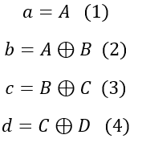
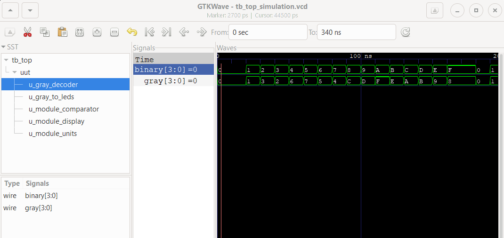
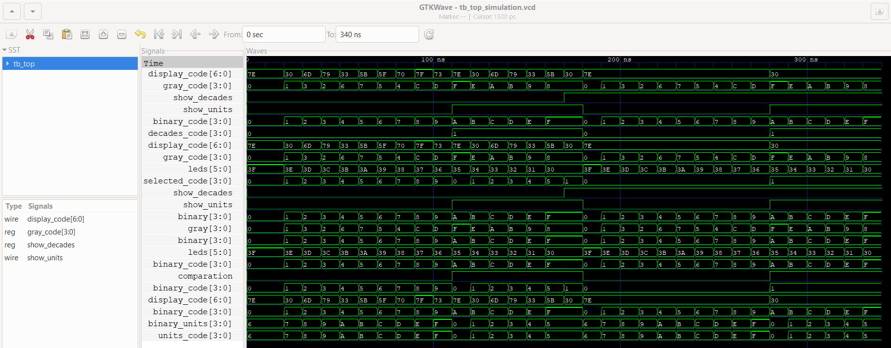

# Primer proyecto de Diseño Lógico | Informe
Este es un proyecto de diseño que consiste en un decodificador de código Gray a código binario. Además, la finalidad es que el código decodificado sea representado mediante cuatro LEDs y también mediante un display de 7 segmentos, las señales de entrada al decodificador se establecen por medio de un switch y son procesadas por lógica booleana que se encuentra guardada dentro de la FPGA.
## Integrantes
Elizondo Espinoza Juan Pablo

Quiros Avila Karina

Tencio Solano José Eduardo
## Descripción de funcionamiento 
Se trata de un circuito decodificador que recibe una señal de 4 bits por medio de un DIP switch, la señal de 4 bits es recibida por la FPGA la cual tiene todo el código en HDL que se encarga de decodificarlo utilizando álgebra booleana para que sea correctamente representado de las dos formas diferentes en las que se necesita; en el caso del display de 7 segmentos, se hace una codificación adicional para poder mostrar los valores numéricos en sistema decimal adecuadamente y se cuenta con otra entrada adicional que permite seleccionar si lo que se muestra en el display son las unidades o las decenas del número (en caso de que las tenga), al mismo tiempo que las luces LED muestran el código decodificado pero en sistema binario considerando que son cuatro luces LED (una para cada bit del número ingresado en Gray). 

El proyecto cuenta con varios modulos dentro de la carpeta de diseño, los cuales contribuyen al funcionamiento de los tres subsistemas principales en los que se conforma el proyecto, los mismos se detallas a continuación. 

### Subsistema de lectura y decodificación de código Gray
Este subsistema tiene como entrada principal el dato de 4 bits que está en código Gray, su función es leer dicho código y por medio del álgebra booleana que se encuentra en el módulo gray_decoder.sv dentro de la carpeta de design, convertirlo en código binario para luego enviarle el código ya decodificado a los otros dos subsistemas, los cuales trabajarán a partir de dicho código. 

### Subsistema de código ingresado mostrado en luces LED
El subsistema encargado de mostrar el dato en binario en las luces LED es este. Recibe el código ya convertido a binario por el primer subsistema, lo adapta a un dato de 6 bits considerando que la FPGA utilizada cuenta con 6 LEDs, para que de esta forma los últimos dos estén apagados y los primeros cuatro dependan del código que reciba el subsistema. El procedimiento se encuentra en el módulo gray_to_leds.sv dentro de la carpeta de design.

### Subsistema de código ingresado desplegado en el display de 7 segmentos
Este es el subsistema que requiere de una mayor cantidad de módulos dentro de la carpeta de design, debido a su naturaleza y con la intensión de que funcione de la mejor manera posible. El subsistema debe de recibir el código en binario que decodificó el primer subsistema, luego separa las unidades del número ingresado (esto lo hace independientemente de si el número lo requiere o no), debe de verificar si el código en binario representa un número de más de dos cifras en el sistema decimal para luego tomar la desición de si utilizar el dato completo que recibió o bien si utiliza las unidades que ya separó; además, considerando que solo se trabajará con números del 0 al 15 en el sisteam decimal, las decenas de los números siempre van a ser 1 en caso de que las tengan y si no las tienen se le asigna un 0 al valor de las decenas del número, esto se logra utilizando una variable a la cual se le asigna su valor por medio de un Mux, el subsistema también debe de considerar si se le está ordenando que muestre únicamente las unidades del número o bien las decenas. 

Todo lo anteriormente mencionado se hace gracias al trabajo en conjunto de tres módulos dentro de la carpeta de desing: module_display.sv, module_comparator.sv y module_units.sv.

El module_display.sv es el que se encarga de convertir el dato en un código de de 7 bits con el que se encienden los segmentos necesarios del display (todo mediante álgebra booleana), el module_comparator.sv se encarga de verificar si el código en binario que el primer submodulo envió es mayor o menor a 9 para de esta forma ver si cuenta o no con decenas y el module_units.sv es el que agarra el código en binario recibido y le separa sus unidades. 

### Módulo module_top.sv
Este es el módulo principal que conecta y maneja a los demás módulos dentro de la carpeta de design. El módulo recibe la señal directa que se envía por medio del DIP switch, así como la señal para controlar si se van a mostrar las decenas o las unidades por medio de un botón, seguidamente le envía el código recibido en Gray al decodificador gray_decoder.sv y almacena el dato devuelto en una variable lógica de 4 bits llamada binary_code.

Luego, binary_code es enviada a gray_to_leds.sv para que este módulo devuelva una variable de 6 bits llamada leds, la cual será utilizada para controlar a los 6 LEDs que contiene la FPGA. 

Al mismo tiempo, binary_code se envía al module_comparator.sv y module_units.sv para que se separen las unidades y se compruebe si el dato es mayor a 9 en una representación decimal, recibiendo show_units e units_code respectivamente. Luego, por medio de dos multiplexores, se verifica si en ese momento se desea mostrar las unidades o las decenas del número (si el botón está precionado o no), así como determinar qué código será el que se le enviará al display_code.sv para su codificación en un código adecuado para el display de 7 segmentos.

Finalmente, el código que se seleccione y se almacene en selected_code es enviado a module_display.sv y este módulo entrega como resultado el código para controlar el display, que lleva por nombre display_code.

## Diagramas de bloques
Se muestran tres diagramas de bloques que muestran el proceso que siguen los datos principales a lo largo del circuito, desde la entrada hasta las posibles salidas. Separados en los tres subsistemas.

### Subsistema de lectura y decodificación de código Gray
Como ya se mencionó, todos los módulos se conectan por medio del módulo top, por lo que la señal en Gray sale de dicho módulo y entra nuevamente decodificada en código binario. 

### Subsistema de código ingresado traducido a binario en luces LED
Este diagrama trabaja bajo la misma idea que el anterior. 

### Subsistema de despliegue del código ingresado en el display de 7 segmentos
Este es el diagrama más complejo, ya que para desplegar el código en el display de 7 segmentos no es suficiente con decodificarlo, si no que se deben de tomar en consideración más aspectos. 

Cabe mencionar que los multiplexores que aparecen en el diagrama tienen dos salidas; sin embargo, esto es para representar las dos salidas posibles, ya que existen varios escenarios, pero solo puede darse una única salida al mismo tiempo. Por eso para el primer mux se considera el caso en el que el botón esté precionado o no (esto para mostrar las decenas o no), y en el segundo mux se considera si se van a mostrar las unidades que ya se separaron, o si no es necesario y se puede mostrar el código binario de 4 bits tal como se recibió. 

## Ejemplo de simplificación de ecuaciones booleanas

En el proceso de conversión de código Gray a binario, se utilizan ecuaciones booleanas para calcular los bits binarios a partir de los bits del código Gray. Estas ecuaciones se derivan inicialmente de los mapas de Karnaugh presentados en la siguiente imagen. 

La simplificación de estas ecuaciones es esencial para lograr una implementación eficiente en hardware, por ende se utilizan ecuaciones simplificadas mediante la operación XOR: 

Siguiendo estas ecuaciones y el modulo gray_decoder, se obtiene que, En la ecuacion uno, para el bit más significativo del binario (binary[3]), se observa que es igual al bit más significativo del código Gray (gray[3]). Esta asignación directa se basa en la propiedad que el bit más significativo en Gray no se altera durante la conversión a binario: assign binary[3] = gray[3];.

En la ecuación dos, para el segundo bit binario (binary[2]), se aplica la operación XOR entre el bit más significativo del Gray (gray[3]) y el segundo bit del Gray (gray[2]): assign binary[2] = gray[3] ^ gray[2];. Esta simplificación se deriva del hecho de que cada bit del binario depende de la diferencia entre bits consecutivos del Gray, reflejada en la operación XOR.

En la ecuación tres, para el tercer bit del binario (binary[1]) se calcula mediante la operación XOR entre el segundo bit binario (binary[2]) y el tercer bit del Gray (gray[1]): assign binary[1] = binary[2] ^ gray[1];. Esta relación demuestra cómo el valor de cada bit binario es una combinación de los bits anteriores, siguiendo la lógica de que cada bit adicional en Gray se suma a los bits anteriores para formar el binario.

Y finalmente, en la ecuación cuatro, para el bit menos significativo del binario (binary[0]) se determina mediante la operación XOR entre el tercer bit binario (binary[1]) y el bit menos significativo del Gray (gray[0]): assign binary[0] = binary[1] ^ gray[0];. Esta última ecuación completa el proceso de conversión asegurando que cada bit binario refleja correctamente la secuencia del código Gray.

## Ejemplo y análisis de una simulación funcional
A continuación, se presenta la simulación correspondiente al diseño del decodificador de Gray a Binario. Tal como se puede apreciar en la imagen, la decodificación se realizó de manera correcta, lo cual se verifica a través de varios casos. 

Por ejemplo, al analizar el número decimal 2, este corresponde al valor 3 en código Gray y, al ser decodificado, se obtiene correctamente el valor binario 2. Otro caso a destacar es el número decimal 7, que en código Gray se representa como 4 y, tras la decodificación, se traduce al valor binario 7. De manera similar, el número decimal 15 se representa como 8 en código Gray, y el diseño lo convierte adecuadamente en 15 en binario. Estos ejemplos, junto con otros casos, demuestran que el diseño del decodificador ha sido exitoso.

En el apartado "Subsistema de lectura y decodificación de código Gray" se detalló el módulo implementado para llevar a cabo esta tarea. El módulo gray_decoder implementado para realizar la conversión de Gray a binario se basa en un conjunto de operaciones lógicas que descomponen el valor en Gray en sus componentes binarios equivalentes. El bit más significativo del número binario es idéntico al bit más significativo del código Gray, mientras que los bits restantes se calculan mediante operaciones XOR sucesivas entre los bits adyacentes de Gray y el resultado parcial binario. Este método es eficiente porque preserva la relación secuencial entre los bits en Gray, lo que garantiza una conversión precisa y directa. La implementación ha demostrado ser correcta en las pruebas realizadas, lo que respalda su funcionalidad en el contexto del proyecto.

Ahora, en la siguiente imagen se presenta la simulación del funcionamiento del sistema diseñado para decodificar el código Gray y visualizarlo en LEDs y un display de 7 segmentos.

Al comenzar la simulación, la señal gray_code, que representa el código Gray de 4 bits, se establece en 0. El módulo de decodificación convierte este código a binario (0), y los LEDs permanecen apagados, indicando que la conversión es correcta. A medida que se cambian los valores de gray_code, el sistema sigue decodificando adecuadamente cada entrada. Por ejemplo, cuando gray_code se establece en 1, se convierte correctamente a 1 en binario, encendiendo el LED correspondiente. El sistema maneja de manera efectiva todas las entradas posibles de código Gray, desde 0 hasta F, encendiendo los LEDs correctos para cada valor.

El display de 7 segmentos también refleja correctamente la salida del sistema. La señal display_code se actualiza de acuerdo con la representación binaria del código Gray decodificado. Por ejemplo, cuando el código Gray correspondiente al número 6 se convierte en 4 en binario, el display_code muestra el valor 33 en la simulación. Este valor 33 corresponde a la configuración específica en la FPGA para encender los segmentos adecuados del display, lo que permite mostrar el número correcto (4). De manera similar, el sistema procesa otros códigos Gray y actualiza el display_code para representar correctamente los números en el display de 7 segmentos.

## Análisis del consumo de recursos
El análisis de los recursos utilizados en el proyecto se ha realizado utilizando los datos generados por la síntesis de la FPGA. A continuación, se detallan los principales recursos utilizados:

### Número de wires 
Total de Wires: 232
Total de Bits en Wires: 298
Número de Wires Públicos: 232
Número de Bits en Wires Públicos: 298
El diseño utiliza 232 wires, que representan las conexiones lógicas entre los diferentes bloques del circuito. Estos wires transportan un total de 298 bits de información. Todos los wires son públicos, lo que indica que están accesibles para la interconexión entre módulos.

### Memorias
Número de Memorias: 0
Número de Bits en Memorias: 0
No se han utilizado bloques de memoria en este diseño. Esto es coherente con la naturaleza del proyecto, que no requiere almacenamiento de datos, sino que se basa en la conversión y despliegue de señales en tiempo real.

### Procesos
Número de Procesos: 0
El diseño no incluye procesos secuenciales. Esto sugiere que todo el circuito es combinacional, donde las salidas dependen directamente de las entradas sin la necesidad de elementos de almacenamiento como registros.

### Celdas lógicas utilizadas
Total de Celdas: 246
ALU (Unidad Aritmética Lógica): 3
GND (Tierra): 1
IBUF (Buffer de Entrada): 5
LUT1 (Tabla de Búsqueda de 1 Entrada): 73
LUT2 (Tabla de Búsqueda de 2 Entradas): 8
LUT3 (Tabla de Búsqueda de 3 Entradas): 10
LUT4 (Tabla de Búsqueda de 4 Entradas): 27
MUX2_LUT5 (Multiplexor con Tabla de Búsqueda de 5 Entradas): 56
MUX2_LUT6 (Multiplexor con Tabla de Búsqueda de 6 Entradas): 28
MUX2_LUT7 (Multiplexor con Tabla de Búsqueda de 7 Entradas): 14
MUX2_LUT8 (Multiplexor con Tabla de Búsqueda de 8 Entradas): 7
OBUF (Buffer de Salida): 13
VCC (Voltaje de Referencia Positivo): 1
El diseño utiliza un total de 246 celdas lógicas, distribuidas principalmente en tablas de búsqueda (LUTs) y multiplexores. Las LUTs de 1 entrada (LUT1) son las más utilizadas, con un total de 73 instancias, seguidas por los multiplexores de 5 entradas (MUX2_LUT5), que son 56 en total.
ALU: Se utilizan 3 ALUs, lo que sugiere que se realizan algunas operaciones aritméticas simples en el diseño.
Buffers: Se utilizan 5 buffers de entrada (IBUF) y 13 buffers de salida (OBUF), lo que es consistente con la necesidad de gestionar las señales de entrada y salida en la FPGA.

### Resumen del Uso de recursos
El diseño es eficiente en cuanto al uso de recursos, con un total de 246 celdas lógicas empleadas. No se utilizan recursos de memoria ni procesos secuenciales, lo que simplifica el diseño y lo hace adecuado para implementarse en la FPGA Tang Nano 9K. La distribución de celdas lógicas y el uso de multiplexores y LUTs refleja un enfoque optimizado para la conversión de código Gray a binario y la gestión de la visualización en los LEDs y el display de 7 segmentos.

### Síntesis
   Number of wires:                232
   Number of wire bits:            298
   Number of public wires:         232
   Number of public wire bits:     298
   Number of memories:               0
   Number of memory bits:            0
   Number of processes:              0
   Number of cells:                246
     ALU                             3
     GND                             1
     IBUF                            5
     LUT1                           73
     LUT2                            8
     LUT3                           10
     LUT4                           27
     MUX2_LUT5                      56
     MUX2_LUT6                      28
     MUX2_LUT7                      14
     MUX2_LUT8                       7
     OBUF                           13
     VCC                             1

## Análisis de los problemas encontrados durante el desarrollo del proyecto
Durante el desarrollo del proyecto, se encontraron y solucionaron varios problemas que afectaban el funcionamiento del diseño. A continuación, se detallan los principales errores y problemas presentados, así como las acciones correctivas implementadas.
### Problemas Eléctricos
Uno de los problemas iniciales que se presentó estuvo relacionado con la conexión física del diseño. Al introducir el código Gray en la FPGA, solo se desplegaban los números 1, 3, 7 y 15 en los LEDs, lo que indicaba un funcionamiento incorrecto del decodificador Gray a binario. Después de una revisión exhaustiva, se identificó que el error se debía a la utilización de un pin incorrecto como alimentación en el circuito.

•	Causa del Error: Uso de un pin incorrecto de la FPGA para la alimentación del circuito.

•	Solución Implementada: Se revisaron meticulosamente las conexiones de los pines de entrada, alimentación y tierra (GND), y se corrigió la conexión del pin de alimentación. Tras esta corrección, el decodificador comenzó a funcionar correctamente, desplegando todos los números esperados en los LEDs.

### Problemas en el Código
Otro problema significativo se presentó en el módulo module_display.sv, que se encarga de controlar el despliegue del código binario en el display de 7 segmentos. Inicialmente, la FPGA no desplegaba el código en el display, lo que llevó a una revisión del código fuente. El problema se localizó en la definición de la señal de salida, la cual no estaba correctamente declarada ni asignada, lo que impedía la correcta visualización en el display.

•	Causa del Error: Mala definición y asignación de la señal de salida en el módulo module_display.sv.

•	Solución Implementada: Se corrigió la declaración y asignación de la señal de salida en el código, asegurando que la señal correspondiente al número binario se transmitiera correctamente al display de 7 segmentos. Esta corrección permitió que el display mostrara los números adecuados conforme al código binario decodificado.

